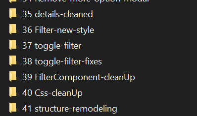

# Sports Events Calendar

## Overview

This project is a sports event calendar application that allows users to view, add, and manage events. It features a calendar interface, detailed event pages, and a form for adding new events. The application is fully responsive, ensuring usability across all devices. A simple navigation system lets users easily switch between the calendar and event creation pages. Optional features include event filters and persistent storage using local storage.

- **Sport Filters**:  
  The filter options are based on predefined sports like "Football," "Ice Hockey," "Basketball," and "Tennis" or any given sport by the user. And i added a search, start date and end date: the search(by the sport) is character sensitive and it give instant result by characters entered in the input area and the start date shows the event from the entered date up to this current day, and if we want to only see the events between start date till end date, you can enter the end date to see the result. This list is being fetched from the "sportData.json" file and also the hardcoded example in the task, and users can filter events based on these sports or by searching for them.

- **Add Events Form**:
  I have Given the Form some basic input that user can by entering the asked data, add a new event into the calendar and it is also like other events, can the full details be shown by clicking them in the calendar.

- **Event Detail Page**:
  By clicking any event in the calendar, the event will lead us into the detail page of that event, if the details to related matches are available , the info will be shown and if not available, the result of these matches will be shown as "N/A" or ""Not Available".

- **Navigation**:
  a very simple navigation that make the job done that can be accessed everywhere in the page and also can navigate between the Calendar overView and Add Event Form page.

## Decisions

because of high amount of different libraries and dependencies for calendar, i had to find the proper one that i can do all the tasks with, after some research i decided to use the "react-calendar" and "date-fns" which can handle all the tasks needed to be done.

## Test:

for each component there is a test with the name like(####.test.js) that have some tests inside that verify some function in the components, to check the test, you can use "npm test" to see through the tests.

## • Version Control: Commit your code regularly with clear and descriptive commit messages in the gitHub.

I have sadly miss this part, but i have done this part locally if this helps:


## Styling and Responsiveness:

i have applied some very basic styling and responsiveness through the Calendar that should make it work on different devices with different resolutions.

## How to Run the Application

### Prerequisites:

Make sure you have the following installed:

- [Node.js](https://nodejs.org/) (v12 or higher)
- [npm](https://www.npmjs.com/) (Node Package Manager)

### Steps to Run:

1. Clone this repository to your local machine and how to install:
   ```bash
   git clone https://github.com/AHK-G/Sport-Calendar-Arash-Hatamikia.git
   ```
   ```bash
   cd Sport-Calendar-Arash-Hatamikia
   ```
   ```bash
   npm install
   ```
   ```bash
   npm start
   ```

## Available Scripts

In the project directory, you can run:

### `npm start`

Runs the app in the development mode.\
Open [http://localhost:3000](http://localhost:3000) to view it in your browser.

The page will reload when you make changes.\
You may also see any lint errors in the console.

### `npm test`

Launches the test runner in the interactive watch mode.\
See the section about [running tests](https://facebook.github.io/create-react-app/docs/running-tests) for more information.

### `npm run build`

Builds the app for production to the `build` folder.\
It correctly bundles React in production mode and optimizes the build for the best performance.

The build is minified and the filenames include the hashes.\
Your app is ready to be deployed!

See the section about [deployment](https://facebook.github.io/create-react-app/docs/deployment) for more information.

```

```
